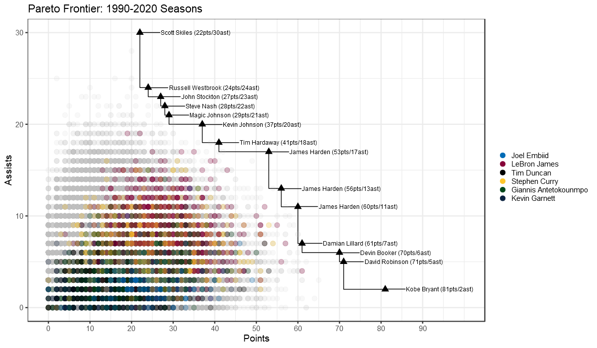

***

**Application: [Andrew Patton](@anpatt7.bsky.social)**

***

# What Exactly Is a Pareto Game?

Broadly speaking, this application is about exploring players and games that are unique or interesting. It's not about quality, although you'll see great players pop up quite often. [The idea for this exploration came from a 538 article on James Harden, and we can reuse their definition in a box score context](https://fivethirtyeight.com/features/explaining-james-hardens-monster-game-with-a-century-old-economic-theory/).

**“A player has a Pareto game if no other player has ever posted better numbers in all [pick a number] stats in a single game. Certainly other players have scored more points than Harden in a single game (60), and some have done so with more assists or more rebounds. But no player has beaten him in all categories at the same time.”**

Let's take a look using some real data in the chart below. In this example, we're using points and assists. On this chart is every regular season game from the 1990-2020 seasons. The black triangles are the Pareto nodes, and the black line is the Pareto frontier. Starting from the top, we see Scott Skiles has 22pts and 30ast. No other game in history had a player with more in both. Now on the bottom of the chart, Kobe Bryant's line of 81pts and 2ast (lots of ball movement there) has also not been surpassed in both categories. Every node in between also fits that category. In order for a new node to be created, a player needs to score and assist such that their coordinates are to the right/above of the frontier (black line). This can be done with any combination of stats you want, it just happens that 2D ones are much easier to chart.

